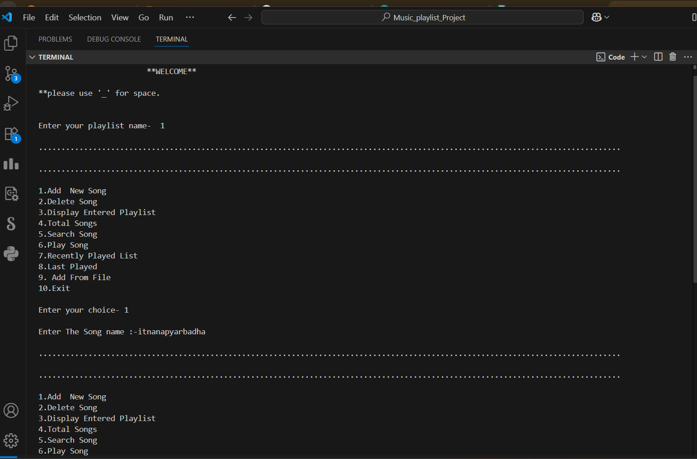

# 🎶 C++ Music Playlist Manager 🎶

Welcome to the **C++ Music Playlist Manager**, a powerful terminal-based application that lets you create, manage, and play songs just like a real playlist!
This project is entirely written in **C++** using **File Handling** and **Doubly Linked Lists**, making it both a data structures demo and a fun utility.

---




---

## 🧠 Features

- 📂 Add new songs to your playlist (stored in a file)
- ❌ Delete songs by name or position
- 🔍 Search for songs in the playlist
- ▶️ Play songs and track recent plays
- 🧾 View the most recently played song
- 📜 View entire playlist from file
- 🔢 Count the total number of songs
- 🔁 Persistent storage using `MyPlayList.txt`

---

## 💡 Tech Stack

| Tech | Usage |
|---------------|-------------------------------|
| **C++** | Core programming logic |
| **File I/O** | To save and load songs |
| **DSA** | Doubly Linked List, Stack |
| **Terminal UI** | Text-based interactive menu |

---
 ## 📁 File Structure ``` . ├── MusicPlayer.cpp # Main program file ├── MyPlayList.txt # Stores the playlist (auto-created) ├── temp.txt # Temporary file for delete operations └── app.png # UI Screenshot (add manually) ``` 
---

## 🛠️ How to Run

### ✅ Prerequisites
- A C++ compiler (e.g., `g++`)
- A terminal/console

### 🚀 Run Instructions

```bash
# Step 1: Compile the code
g++ main.cpp -o playlist

# Step 2: Run the app
./playlist


| Option | Functionality |
| ------ | -------------------------------- |
| 1 | Add a new song to playlist |
| 2 | Delete a song (by search or pos) |
| 3 | Display the current playlist |
| 4 | Count total songs |
| 5 | Search for a song |
| 6 | Play a song and track history |
| 7 | Show recently played list |
| 8 | Show the last played song |
| 9 | Load playlist from saved file |
| 10 | Exit the application |


**WELCOME**
please use '_' for space.

Enter your playlist name- My_Playlist

1. Add New Song
2. Delete Song
3. Display Entered Playlist
...

Enter your choice - 1
Enter The Song name :- Believer
=> Song added to file!

Enter your choice - 3
PlayList Name :-
Believer

🧠 Concepts Covered
📚 Data Structures: Doubly Linked List, Stack
💾 File Handling: Read/Write/Update using fstream
🧠 Memory Management: malloc, free
📌 Basic Algorithms: Search, Delete by position

🤝 Contribution
Have ideas for improvement? Feel free to fork the repo, raise an issue or submit a pull request!


📬 Contact
Created with ❤️ by [Gufran Khan]
📧 Email: gufrankhan123kab.com
🌐 GitHub: https://github.com/iGufrankhan
